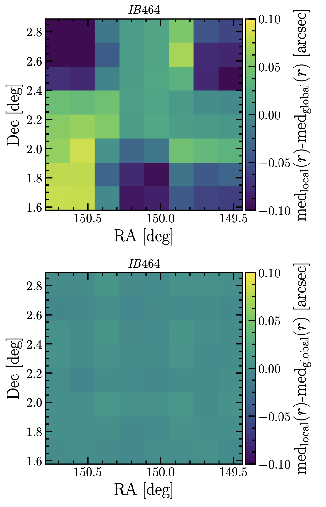

---
direction:
- instruments
title: Point Spread Function improvement for COSMOS2020 survey
summary: Solving the issue of spatially varying PSFs for the COSMOS survey
tags:
- Galaxies
- Cosmology
- Observations
date: '2022-01-20T00:00:00Z'
draft: false
featured: false
url_pdf: https://arxiv.org/pdf/2110.13923.pdf
image: featured.jpg
---

## The two CATALOGS: https://cosmos2020.calet.org/ 

The COSMOS survey is one the longest-running galaxy surveys. Over two decades, we have collected observations of x-ray, optical, infrared, and radio light to obtain galaxy distances and understand their evolution over 13.7 billion years of cosmic history. [John R. Weaver](https://astroweaver.github.io/) at the [Cosmic Dawn Center](https://cosmicdawn.dk/) lead the 2020 edition of the master galaxy catalog, using bleeding-edge galaxy model-fitting techniques. 

I worked with John to improve what astronomers call a Point Spread Function, or PSF for short, which essentially details how light becomes spread out and noisy as it moves through the atmosphere. As one might imagine, this isn't the same across the night sky, due to the atmosphere being quite different when looking in different directions. As can be seen in the below figure, if one separates the night-sky into many smaller patches, giving each patch its own PSF, things are a lot better!

